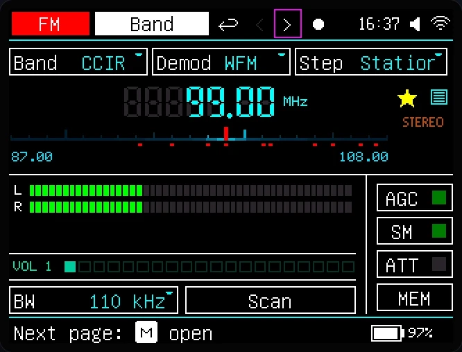

# OmniRadio

**One radio and network-audio interface—on a physical display or directly in your browser.**

OmniRadio brings internet radio, podcasts, audiobooks, broadcast radio, local audio, and voice communication to the ESP32-S3. Start with a bare ESP32-S3 N16R8, then add only the hardware and features you actually want.

[Read the OmniRadio documentation](https://uandy24.github.io/omniradio-public/) · [Install the deep beta](https://uandy24.github.io/omniradio-public/firmware/) · [Open the GitHub prerelease](https://github.com/uandy24/omniradio-public/releases/tag/v0.9.154-deep-beta)

> **Deep beta:** OmniRadio 0.9.154 is pre-release firmware for testing and development. Expect incomplete features, defects, behavioral changes, and compatibility breaks. Read the installation and recovery instructions before flashing.



## Start with only an ESP32-S3

For the first public build, the minimum hardware is:

- an **ESP32-S3 N16R8** with 16 MB flash and 8 MB octal PSRAM;
- a USB data cable;
- Wi-Fi;
- a browser.

You do **not** need a display, encoder, SI4732, DAC, amplifier, speaker, microphone, or SD card to begin.

On a bare board, OmniRadio can provide:

- **Internet Radio** with discovery, favorites, and stream metadata;
- **Podcasts** with search, subscriptions, bookmarks, and resumable episodes;
- **LibriVox Audiobooks** with discovery, chapters, bookmarks, and saved position;
- **Mumble**, **SIP2SIP**, and **Zello** for listening;
- the amateur-radio **M17** service in listen-only operation;
- the embedded browser portal and interactive Device Mirror;
- **HTTP Stream** playback directly in the browser.

A configured microphone enables Mumble push-to-talk. In the current firmware, M17, Zello, and SIP2SIP remain receive-only regardless of microphone availability.

## One interface in two places

The optional physical display and the browser-based **Device Mirror** show the same native 320 × 240 firmware interface, nearly pixel for pixel. They share the current mode, page, selection, menus, dialogs, and playback state.

The Device Mirror is interactive—not a passive screenshot or a separate simplified web UI. Click its controls or use the virtual encoder actions to operate OmniRadio entirely from a browser. A physical display and encoder are optional.

Select **HTTP Stream** as the active audio target and listen directly on the same Device Mirror page. This makes a bare ESP32-S3 a complete browser-controlled network radio without local audio hardware.

[See the Device Mirror](https://uandy24.github.io/omniradio-public/ui/canvas/) · [Open and use the portal](https://uandy24.github.io/omniradio-public/portal/)

## Add only the hardware you need

| Optional hardware | Capabilities it adds |
| --- | --- |
| ST7789 display and encoder | A self-contained physical interface showing the same UI as the browser mirror |
| I2S output and amplifiers | Local speaker playback |
| SI4732 receiver and required audio path | FM, AM, shortwave, and SSB reception |
| SD card | Local files, playlists, recordings, and USB storage access |
| Microphone | Voice capture, recording, and Mumble push-to-talk |
| SI4713 transmitter | FM Audio as an output target |

The same firmware can run as a headless network radio, a simple internet-radio appliance, or a fully equipped broadcast and communication device.

## Listen to broadcast radio anywhere on your network

Optional broadcast-radio hardware adds more than FM, AM, shortwave, and SSB controls. With an SI4732 receiver and the required digital audio-capture path, received broadcast audio becomes an OmniRadio source. Send it to:

- the **Device Mirror and HTTP Stream** to listen on a computer or phone;
- a compatible **DLNA renderer**, including a network speaker;
- configured **Local Audio** speakers;
- supported file recording when storage is available.

```text
FM / AM / SW / SSB receiver → OmniRadio → browser, DLNA speaker, or local speakers
```

## Play Internet Radio on an ordinary FM receiver

Routing works in the other direction too. Add an SI4713 transmitter and select **FM Audio** as the target. A compatible source—such as Internet Radio, a podcast, an audiobook, a local file, or received communication audio—can then be heard on an ordinary nearby FM receiver.

```text
Internet Radio / Podcast / File → OmniRadio → SI4713 → ordinary FM receiver
```

This is the practical value of separating sources from targets: what you listen to and where you hear it are independent choices, subject to the active mode, codec, transport, and connected hardware.

## The interface follows your settings and hardware

OmniRadio does not expose every function merely because its code exists in the firmware.

A mode, communication service, page, or audio target appears only when:

1. it is enabled in the device feature settings;
2. its required hardware is configured and available;
3. its current runtime requirements, such as a Wi-Fi connection, are met.

For example:

- enabling FM does not show the FM mode unless an SI4732 receiver is detected;
- disabling Podcasts hides the Podcast mode even when Wi-Fi is connected;
- Files stays hidden without configured SD storage;
- Local Audio stays hidden without configured amplifier hardware;
- Mumble listening remains available without exposing microphone-dependent PTT controls;
- M17, Zello, and SIP2SIP remain receive-only in the current firmware.

Missing optional hardware therefore does not leave empty modes or broken controls in normal navigation.

## Keep only the features you want

Optional modes can be disabled individually. The communication services and audio targets can also be selected separately.

You can, for example:

- disable Podcasts and Audiobooks;
- hide the complete Walkie-ListenTalkie mode;
- keep Mumble while disabling M17, Zello, and SIP2SIP;
- disable unused Local Audio, DLNA, HTTP Stream, or FM Audio targets;
- reduce OmniRadio to **Internet Radio with HTTP Stream** and nothing else in its everyday interface.

These choices hide features from the product interface; they do not remove their code from the firmware. Settings and recovery access remain available so the configuration can be changed safely later.

> **You choose the features. OmniRadio shows only what the current device can use.**

## What OmniRadio can grow into

### Listening and media

- FM reception with tuning, scanning, presets, signal information, RDS, and Band Scope
- AM, longwave, medium-wave, and shortwave reception with scanning, presets, and EiBi schedules
- SSB reception with USB, LSB, CW, BFO, tuning step, and bandwidth control
- Internet radio with direct HTTP/HTTPS streams and Radio Browser discovery
- Podcast discovery, subscriptions, bookmarks, and resumable playback
- LibriVox audiobook discovery, chapters, bookmarks, and saved position
- Local files, folders, playlists, metadata, and removable storage

### Communication and recording

- Mumble, M17, Zello, and SIP2SIP inside one Walkie-ListenTalkie experience
- Mumble listening without a microphone, with push-to-talk when a microphone is configured
- Receive-only M17, Zello, and SIP2SIP operation in the current firmware
- Microphone input, level monitoring, compatible target routing, and voice recording when hardware is available
- File recording from supported sources to optional storage

### Audio destinations

- **Local Audio** through configured I2S output and amplifiers
- **DLNA** to a compatible renderer on the local network
- **HTTP Stream** to the browser or another compatible LAN client—including captured FM, AM, shortwave, and SSB audio when the receiver and digital capture path are present
- **FM Audio** through an optional SI4713 transmitter, allowing compatible network and local sources to play on an ordinary FM receiver

The current firmware selects one active target at a time. Source and target remain separate: changing what you listen to does not inherently change where its audio is delivered.

## Install the deep beta

The public build supports **ESP32-S3 N16R8**. N8 variants are not supported.

1. Download the complete USB package.
2. Verify the included SHA-256 checksum.
3. Erase flash for a first installation.
4. Write the universal `firmware.bin` image at `0x0`.
5. Restart, join the generated `omniradio_XXXX` access point, and open the embedded portal.
6. Add your normal Wi-Fi network and use the Device Mirror from a browser.

[Download OmniRadio 0.9.154 Deep Beta](https://github.com/uandy24/omniradio-public/releases/tag/v0.9.154-deep-beta) · [Read the complete USB installation guide](https://uandy24.github.io/omniradio-public/firmware/usb-install/) · [Read update and recovery instructions](https://uandy24.github.io/omniradio-public/firmware/update-recovery/)

## One product rather than separate demos

OmniRadio uses one navigation model, one physical/browser interface, shared persistence, and a common audio-routing system.

- A **mode** represents the current listening, communication, or configuration context.
- A **page** presents one focused view of a mode.
- A **source** produces audio or live media state.
- A **target** determines where compatible audio is delivered.
- The shared **Canvas UI** renders both the physical display and browser Device Mirror.
- The embedded **portal** provides interactive control, configuration, profiles, files, and system management.

This structure lets new capabilities participate in the same product instead of becoming unrelated applications hidden behind one menu.

## Local and hardware-aware by design

- Everyday operation can use the physical controls or the local browser mirror.
- The portal is served by the ESP32-S3 itself; this public website only documents the product.
- Device configuration remains local.
- Public HTTPS connections use the maintained ESP-IDF CA bundle and hostname validation.
- The local portal can use a device-generated HTTPS certificate.
- Saved secret fields are redacted in portal responses and protected in persistent configuration where implemented.

Actual capabilities always depend on feature settings, available hardware, network state, codecs, transports, and the active mode.

## Documentation

- [Getting Started](https://uandy24.github.io/omniradio-public/start/what-is-omniradio/) — preparation, first boot, Wi-Fi, portal access, and navigation
- [Firmware installation](https://uandy24.github.io/omniradio-public/firmware/) — download, USB installation, update, and recovery
- [Internet Radio](https://uandy24.github.io/omniradio-public/modes/internet-radio/), [Podcasts](https://uandy24.github.io/omniradio-public/modes/podcasts/), and [Audiobooks](https://uandy24.github.io/omniradio-public/modes/audiobooks/) — network listening on a bare board
- Broadcast Radio: [FM](https://uandy24.github.io/omniradio-public/modes/fm/), [AM and shortwave](https://uandy24.github.io/omniradio-public/modes/am/), and [SSB](https://uandy24.github.io/omniradio-public/modes/ssb/) — tuning, scanning, presets, signal information, RDS, EiBi, BFO, and Band Scope
- [Walkie-ListenTalkie](https://uandy24.github.io/omniradio-public/modes/walkie-listentalkie/) — Mumble, M17, Zello, and SIP2SIP
- [Audio targets](https://uandy24.github.io/omniradio-public/targets/) — Local Audio, DLNA, HTTP Stream, and FM Audio
- [Connected hardware](https://uandy24.github.io/omniradio-public/hardware/) — optional devices, buses, pins, and diagnostics
- [Configuration reference](https://uandy24.github.io/omniradio-public/reference/configuration/) — feature choices, settings, files, persistence, and recovery
- [Troubleshooting](https://uandy24.github.io/omniradio-public/troubleshooting/) — boot, hardware, radio, storage, and network problems

## Repository and release status

This public repository contains the project description, generated documentation site, and public firmware releases. Firmware source remains in a separate private development repository.

The current firmware is a **deep beta**, not a stable release. The N16R8 image layout, first installation, update, recovery, and data-preservation procedures have been validated on physical hardware. That validation covers release mechanics; it does not imply that every firmware feature is complete or stable.
